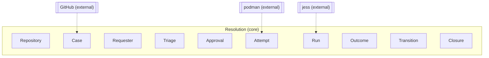
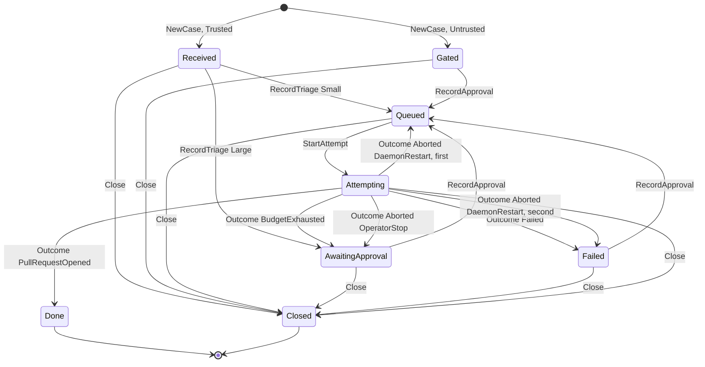
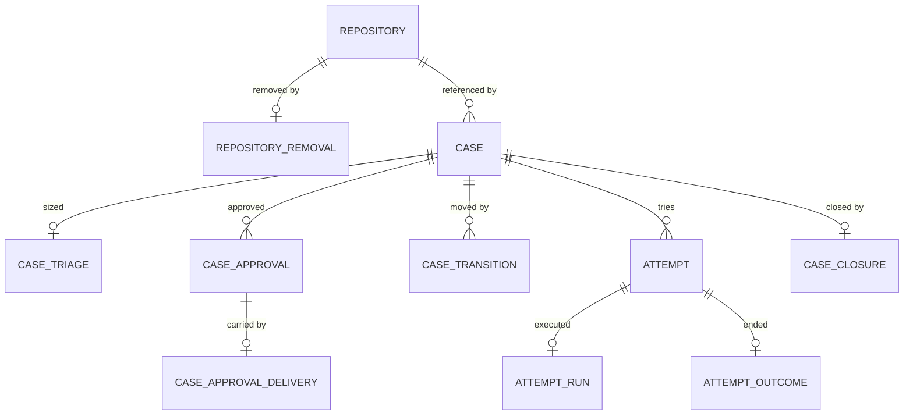
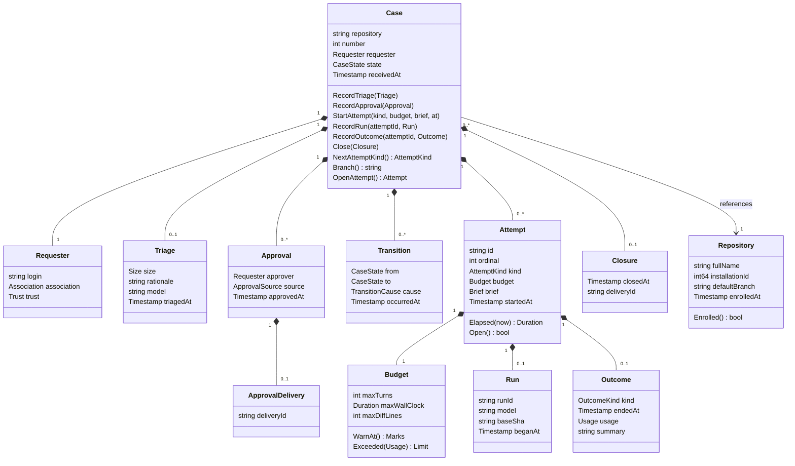

# Resolution domain model

## Contexts

GitHub deliveries become commands on Case. podman hosts an Attempt's workspace and container. jess executes a Run. Nothing from those systems crosses into Resolution types.

## Case

Entity, aggregate root. One issue in one enrolled repository that autophage is handling.

### Fields

| Field | Type | Meaning |
|---|---|---|
| `repository` | string | `Repository.fullName`, `owner/name`. Immutable. Identity with `number` |
| `number` | int | GitHub issue number, at least 1. Immutable |
| `requester` | Requester | Who opened the issue and the trust verdict made at receipt |
| `state` | CaseState | The aggregate's summary of its facts, updated in the same transaction as each fact |
| `receivedAt` | Timestamp | When the opening delivery was processed |

Triage, approvals, attempts, transitions and closure are not fields. Each is its own object and table; the row's existence is the state. `state` equals the latest Transition's `to`, or the initial state when there is none; it is stored for the state index.

### Behaviors

- `NewCase(repository, number, requester, receivedAt)`: state is Received for a Trusted requester, Gated for Untrusted.
- `RecordTriage(triage)`: Received only. Small to Queued, Large to AwaitingApproval.
- `RecordApproval(approval)`: any state but Done and Closed. Gated, AwaitingApproval and Failed go to Queued. Elsewhere recorded without transition.
- `StartAttempt(kind, budget, brief, startedAt)`: Queued only. Ordinal is the previous max plus one. To Attempting.
- `RecordRun(attemptId, run)`: the open attempt only, at most once.
- `RecordOutcome(attemptId, outcome)`: the open attempt only. Transition by outcome kind, see States. In Closed the outcome is recorded and the state stays Closed.
- `Close(closure)`: any state but Done and Closed. To Closed. A running attempt is aborted by the application and ends with `Aborted{IssueClosed}`.
- `NextAttemptKind()`: Approved if an approval postdates the latest attempt's start, or any approval exists and no attempt does; else Auto.
- `Branch()`: `autophage/<number>`.
- `OpenAttempt()`: the attempt without an outcome, if any.

### Invariants

- A Trusted requester is never Gated; an Untrusted one is never Received.
- At most one Triage, and only while Received.
- At most one attempt without an outcome at any time.
- `RecordRun` and `RecordOutcome` target the open attempt or are refused.
- At most one Closure.
- `Aborted{DaemonRestart}` re-queues once: if any earlier attempt of the case ended `Aborted{DaemonRestart}`, the case goes to Failed instead of Queued.

### States

Anything not drawn is refused by the aggregate.

### Relationships

| With | Kind | Cardinality |
|---|---|---|
| `Repository` | references | n to 1 |
| `Triage` | has-a (owned) | 1 to 0..1 |
| `Approval` | has-a (owned) | 1 to 0..n |
| `Attempt` | has-a (owned) | 1 to 0..n |
| `Transition` | has-a (owned) | 1 to 0..n |
| `Closure` | has-a (owned) | 1 to 0..1 |

## Requester

Value object. The person who opened the issue or added the label, with the trust verdict.

### Fields

| Field | Type | Meaning |
|---|---|---|
| `login` | string | GitHub login |
| `association` | Association | GitHub's `author_association` as delivered. Evidence for the verdict |
| `trust` | Trust | The verdict made under the rule in force at the time |

### Invariants

- `NewRequester(login, association)` computes `trust`: Owner, Member and Collaborator are Trusted; everything else Untrusted. There is no other constructor.

## Triage

Value object, owned by `Case`, table `case_triages`. Exists exactly when a trusted case has been sized.

### Fields

| Field | Type | Meaning |
|---|---|---|
| `repository`, `number` | | Owner key |
| `size` | Size | Small: attempt now under the auto budget. Large: wait for approval |
| `rationale` | string | The triage model's stated reasoning. Posted verbatim as a comment, never executed. Non-empty |
| `model` | string | OpenRouter model id used |
| `triagedAt` | Timestamp | |

### Relationships

| With | Kind | Cardinality |
|---|---|---|
| `Case` | owned by | 0..1 to 1 |

## Approval

Value object, owned by `Case`, table `case_approvals`. One row per `approved` label add.

### Fields

| Field | Type | Meaning |
|---|---|---|
| `repository`, `number` | | Owner key |
| `approver` | Requester | Who approved, with association and trust as evidence. For an operator approval: the App owner's login, Trusted |
| `source` | ApprovalSource | Label: the `approved` label was added on GitHub. Operator: `autophage run` |
| `approvedAt` | Timestamp | |

The delivery behind a label approval is not a field. A label-sourced approval has an `ApprovalDelivery` row; an operator-sourced one has none.

### Relationships

| With | Kind | Cardinality |
|---|---|---|
| `Case` | owned by | n to 1 |
| `ApprovalDelivery` | has-a (owned) | 1 to 0..1 |

## ApprovalDelivery

Value object, owned by `Approval`, table `case_approval_deliveries`. Exists exactly when the approval came from a label event.

### Fields

| Field | Type | Meaning |
|---|---|---|
| `approvalId` | string | Owner key |
| `deliveryId` | string | The GitHub delivery that carried the label event |

### Relationships

| With | Kind | Cardinality |
|---|---|---|
| `Approval` | owned by | 0..1 to 1 |

## Attempt

Entity, owned by `Case`, table `attempts`. One budgeted try at the case on its branch. Starts when the case leaves Queued, before the workspace exists.

### Fields

| Field | Type | Meaning |
|---|---|---|
| `id` | string | Database-generated UUID. Ordering is by `startedAt` |
| `repository`, `number` | | Owner key |
| `ordinal` | int | 1-based position among the case's attempts. Unique per case |
| `kind` | AttemptKind | Which budget policy applied |
| `budget` | Budget | Snapshot of the limits in force |
| `brief` | Brief | The prompt as sent |
| `startedAt` | Timestamp | |

Run and outcome are not fields. An attempt with no Run row never reached the agent (prep failed or was aborted). An attempt with no Outcome row is open.

### Behaviors

- `Elapsed(now)`.
- `Open()`: no outcome recorded.

### Invariants

- `ordinal` at least 1, unique within the case.
- `budget` valid, `brief` non-empty.

### Relationships

| With | Kind | Cardinality |
|---|---|---|
| `Case` | owned by | n to 1 |
| `Run` | has-a (owned) | 1 to 0..1 |
| `Outcome` | has-a (owned) | 1 to 0..1 |

## Run

Value object, owned by `Attempt`, table `attempt_runs`. Exists exactly when the agent began executing.

### Fields

| Field | Type | Meaning |
|---|---|---|
| `attemptId` | string | Owner key |
| `runId` | string | jess ledger run id. `autophage why` joins on it |
| `model` | string | OpenRouter model id the agent ran on |
| `baseSha` | string | The default-branch commit the case branch was rebased onto before the run |
| `beganAt` | Timestamp | |

### Relationships

| With | Kind | Cardinality |
|---|---|---|
| `Attempt` | owned by | 0..1 to 1 |

## Outcome

Value object, owned by `Attempt`, table `attempt_outcomes` plus one table per variant. Exists exactly when the attempt ended. A sum: exactly one variant.

### Fields

| Field | Type | Meaning |
|---|---|---|
| `attemptId` | string | Owner key |
| `kind` | OutcomeKind | Which variant |
| `endedAt` | Timestamp | |
| `usage` | Usage | What the attempt consumed. Zeros when it never reached the agent |
| `summary` | string | The agent's final summary in the fixed shape, or the error text when there was no agent. Non-empty. Posted as the issue comment |

Variant fields:

| Variant | Field | Type | Meaning |
|---|---|---|---|
| PullRequestOpened | `prNumber` | int | The PR autophage opened |
| PullRequestOpened | `headSha` | string | The pushed commit the PR points at |
| BudgetExhausted | `limit` | Limit | Which limit ended it |
| Failed | `class` | FailureClass | Infra, Model or Agent |
| Failed | `message` | string | The error |
| Aborted | `reason` | AbortReason | IssueClosed, OperatorStop or DaemonRestart |

### Relationships

| With | Kind | Cardinality |
|---|---|---|
| `Attempt` | owned by | 0..1 to 1 |

## Closure

Value object, owned by `Case`, table `case_closures`. Exists exactly when the issue was closed on GitHub.

### Fields

| Field | Type | Meaning |
|---|---|---|
| `repository`, `number` | | Owner key |
| `closedAt` | Timestamp | |
| `deliveryId` | string | The delivery that carried the close |

### Relationships

| With | Kind | Cardinality |
|---|---|---|
| `Case` | owned by | 0..1 to 1 |

## Transition

Value object, owned by `Case`, table `case_transitions`. One row per state change, appended in the same transaction as the fact that caused it. The initial state is not a transition.

### Fields

| Field | Type | Meaning |
|---|---|---|
| `caseId` | string | Owner key |
| `from` | CaseState | |
| `to` | CaseState | Differs from `from` |
| `cause` | TransitionCause | Which fact caused it |
| `occurredAt` | Timestamp | The Scheduler orders Queued cases by this |

### Relationships

| With | Kind | Cardinality |
|---|---|---|
| `Case` | owned by | n to 1 |

## Budget

Value object. The limits on one attempt.

### Fields

| Field | Type | Meaning |
|---|---|---|
| `maxTurns` | int | Model turns before the attempt is stopped |
| `maxWallClock` | Duration | From run begin to forced stop |
| `maxDiffLines` | int | Added plus removed lines against `baseSha` |

### Behaviors

- `WarnAt()`: 80% of turns and wall clock, when the wrap-up steer is injected.
- `Exceeded(usage)`: the first Limit crossed, if any.

### Invariants

- All three greater than 0. `NewBudget` refuses otherwise.

## Brief

Value object. The complete prompt for one attempt. Built only by `BuildBrief`.

### Fields

| Field | Type | Meaning |
|---|---|---|
| `text` | string | The prompt as sent |

### Invariants

`BuildBrief(case, repository, kind, budget, issueTitle, issueBody, prior *Outcome)` refuses an empty title or body and always includes, in order: who autophage is and that this is an unattended attempt on `repository` issue `number`; the requester's login and trust and the triage size when one exists; the branch; the budget numbers and that on exhaustion the run is stopped, the work is committed and pushed and a summary is required; the prior outcome's summary when resuming; the instruction to read the repo's `CLAUDE.md` or `AGENTS.md` first, commit as it goes and run the tests; the issue title and body verbatim, fenced as untrusted input; the fixed summary shape (what I found, what I did, what is left, what I would do with more budget).

## Usage

Value object. What one attempt consumed.

### Fields

| Field | Type | Meaning |
|---|---|---|
| `turns` | int | At least 0 |
| `inputTokens` | int | At least 0 |
| `outputTokens` | int | At least 0 |
| `wallClock` | Duration | Run begin to end |
| `diffLines` | int | At least 0, against `baseSha` at end |

## Repository

Entity. An enrolled GitHub repository.

### Fields

| Field | Type | Meaning |
|---|---|---|
| `fullName` | string | `owner/name`. Identity |
| `installationId` | int64 | GitHub App installation that grants access. Opaque; used to mint tokens |
| `defaultBranch` | string | Branch attempts rebase onto and PRs target |
| `enrolledAt` | Timestamp | |

Removal is not a field. A removed repository has a `Removal` row; re-enrollment deletes it.

### Behaviors

- `Enrolled()`: no Removal row.

### Relationships

| With | Kind | Cardinality |
|---|---|---|
| `Case` | referenced by | 1 to 0..n |
| `Removal` | has-a (owned) | 1 to 0..1 |

## Removal

Value object, owned by `Repository`, table `repository_removals`.

### Fields

| Field | Type | Meaning |
|---|---|---|
| `repository` | string | Owner key |
| `removedAt` | Timestamp | |

## Enumerations

**CaseState**: `received`, `gated`, `queued`, `attempting`, `awaiting_approval`, `failed`, `done`, `closed`.

**Trust**: `trusted`, `untrusted`.

**Association**: `owner`, `member`, `collaborator`, `contributor`, `first_time_contributor`, `first_timer`, `mannequin`, `none`. GitHub's closed set, recorded as evidence.

**Size**: `small`, `large`.

**AttemptKind**: `auto`, `approved`.

**OutcomeKind**: `pull_request_opened`, `budget_exhausted`, `failed`, `aborted`.

**Limit**: `turns`, `wall_clock`, `diff_lines`.

**FailureClass**: `infra` (git, podman, GitHub), `model` (provider errors after retries), `agent` (the agent declared it could not).

**AbortReason**: `issue_closed`, `operator_stop`, `daemon_restart`.

**ApprovalSource**: `label`, `operator`.

**TransitionCause**: `triage_small`, `triage_large`, `approval`, `attempt_started`, `outcome_pull_request_opened`, `outcome_budget_exhausted`, `outcome_failed`, `outcome_aborted_operator_stop`, `outcome_aborted_daemon_restart_requeued`, `outcome_aborted_daemon_restart_failed`, `closed`.

## Domain services

- `BuildBrief`: spans Case, Repository, Budget and the prior Outcome. The only constructor of Brief.
- `BudgetFor(kind)`: config lookup, `auto` or `approved`.
- `Scheduler`: the rules that span cases. At most `concurrency` open attempts across all cases; Queued cases start in order of the Transition that queued them; no attempt starts for a removed repository.

Everything else is orchestration in application services: translating deliveries, dispatching queued cases, running an attempt end to end.

## Everything at once

## Open, not assumed

- Budget values for `auto` and `approved`.
- Whether `Aborted{OperatorStop}` should land in AwaitingApproval (chosen here) or Failed.
- Whether a second Triage should be allowed after the issue body is edited. v1: no.
- Diff-line accounting for binary files and renames.
- Whether `Usage.diffLines` counts the whole branch or only this attempt's change. Chosen: whole branch against that run's `baseSha`.
