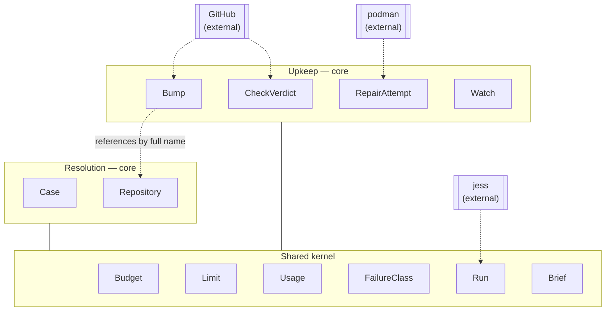
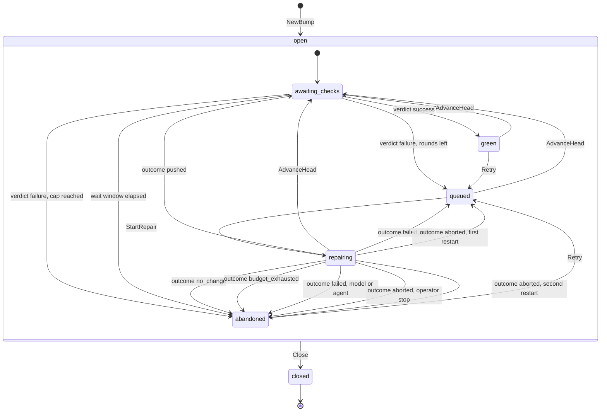
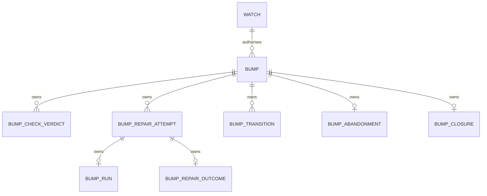

# Upkeep domain model

## Contexts

Nothing but the shared kernel and the repository's full name crosses between
Resolution and Upkeep. A Case never names a Bump and a Bump never names a
Case, even when both are open on the same repository.

## Bump

Entity, aggregate root. One dependency update pull request dependabot opened
on a watched repository, which autophage shepherds until its checks are
green or it gives up.

### Fields

| Field | Type | Meaning |
|---|---|---|
| `id` | string | Store-generated, assigned once after creation |
| `repository` | string | `Repository.fullName`. Immutable |
| `number` | int | The pull request number. Immutable |
| `branch` | string | Dependabot's branch, e.g. `dependabot/npm_and_yarn/lodash-4.17.21`. Stored, not derived: autophage did not name it |
| `baseBranch` | string | The branch the pull request targets, as it was when the bump opened |
| `headSha` | string | The 40-hex sha at the tip of `branch` right now. Changes on every dependabot force-push and every repair push |
| `state` | `BumpState` | |
| `openedAt` | Timestamp | When dependabot opened the pull request |

Abandonment is not a field. An abandoned bump has a `BumpAbandonment` row.
Closure is not a field. A closed bump has a `BumpClosure` row.

What is being bumped (package, ecosystem, from and to version) is not a
field: no rule in this model reads it, and the agent gets it from the diff
in front of it. See "Open, not assumed".

### Behaviors

`NewBump(repository, number, branch, baseBranch, headSha, openedAt)`,
`RecordVerdict(CheckVerdict)`, `AdvanceHead(sha, at)`,
`StartRepair(budget, brief, at)`, `RecordRun(attemptID, Run)`,
`RecordOutcome(attemptID, RepairOutcome)`, `Abandon(BumpAbandonment)`,
`Retry(at)`, `Close(BumpClosure)`, `Rounds()`, `CurrentVerdict()`, `OpenRepair()`.

### Invariants

- Constructed only from a pull request whose author is the dependabot login
  on a watched repository. Neither is re-checked later: a bump that exists
  was authorised at birth.
- `headSha` and every sha the aggregate accepts is 40 lowercase hex.
- At most one open repair attempt (one with no outcome) at any time.
- A `CheckVerdict` whose `headSha` is not the bump's current `headSha` is
  refused, not applied. This is the loop guard: a verdict for a head that a
  repair or a force-push has already replaced can never move the bump.
- At most one `CheckVerdict` per `headSha`. Two would give one head two
  contradictory conclusions and leave the state undecidable.
- `StartRepair` is refused once `Rounds()` has reached the configured cap.
  The cap is the second loop guard, bounding the push, check, push cycle
  even when every verdict is legitimately for the current head.
- A repair round's `baseSha` is the `headSha` that its triggering verdict
  failed on, so the attempt's provenance survives the next force-push.

### States

Anything not drawn is refused by the aggregate. `Close` is drawn once out of
`open` because it applies from all five states inside it.

`green` is deliberately not terminal. Someone merging the pull request is
the most normal end to a green bump, and it arrives as a `pull_request`
delivery after the bump reached `green`. A terminal `green` would refuse
that delivery and record the ordinary ending as a rejection, which is the
bug `autophage-2lq` recorded on the Case side. `abandoned` is not terminal
for the same reason.

A round that fails on infra goes back to `queued` rather than abandoning.
The round is spent either way, so the cap still bounds the retries; giving up
on a bump because podman was busy or GitHub was down would be reading an
outage as a verdict about the code. A model or agent failure is a verdict
about the code, and abandons.

`abandoned` does not return to `awaiting_checks` on `AdvanceHead`.
Abandonment is sticky per bump: a rebase of a version autophage already
failed to repair is not new information, and reviving on every dependabot
force-push is an unbounded retry loop wearing a different name. A genuinely
newer version arrives as a new pull request, hence a new bump.

`Retry` is the one thing that undoes an abandonment, and only an operator
can ask for it. It deletes the abandonment rather than appending a fact,
which is the second place in the system that does so. It exists because
abandonment can follow a transient problem and there would otherwise be no
recourse at all.

### Relationships

| With | Kind | Cardinality |
|---|---|---|
| `CheckVerdict` | has-a (owned) | 1 to n, n ≥ 0, at most one per head sha |
| `RepairAttempt` | has-a (owned) | 1 to n, n ≥ 0 |
| `BumpAbandonment` | has-a (owned) | 1 to 0..1 |
| `BumpClosure` | has-a (owned) | 1 to 0..1 |
| `BumpTransition` | has-a (owned) | 1 to n, n ≥ 1 |
| `Watch` | references | n to 1 |
| `Repository` (Resolution) | references by full name | n to 1 |

## CheckVerdict

Value object, owned by `Bump`, stored as its own table (`bump_check_verdicts`).
Exists exactly when CI reached a conclusive rollup for one head sha.

A rollup is conclusive when no check run or status for that sha is still
queued or in progress. A pending rollup records nothing; the bump stays in
`awaiting_checks` until either a conclusive rollup arrives or the wait
window elapses. This is why the object has no `pending` conclusion: an
unconcluded check is the absence of the row, and the absence has a deadline.

### Fields

| Field | Type | Meaning |
|---|---|---|
| `bumpId` | string | |
| `headSha` | string | The 40-hex sha the checks ran against |
| `conclusion` | `CheckConclusion` | |
| `failingContexts` | string | Newline-separated names of the runs that did not succeed, verbatim from GitHub, empty on success. Handed to the agent in the brief; never executed |
| `detailsURL` | string | The run GitHub points a human at. Empty when GitHub gave none, which a commit status can do; the verdict still stands and the failing contexts are the evidence |
| `concludedAt` | Timestamp | |

### Relationships

| With | Kind | Cardinality |
|---|---|---|
| `Bump` | owned by | n to 1 |

## RepairAttempt

Entity, owned by `Bump`, stored as its own table (`bump_repair_attempts`).
One budgeted try at making a red bump's checks pass, on dependabot's own
branch.

This is the Case-side `Attempt` shape with a different owner and a different
job: it starts from a branch autophage did not create and pushes back onto
it, rather than cutting `autophage/<n>` from the default branch.

### Fields

| Field | Type | Meaning |
|---|---|---|
| `id` | string | Store-generated |
| `bumpId` | string | |
| `round` | int | 1-based. The Nth go at this bump; also what the cap counts |
| `baseSha` | string | The head sha this round started from, which is the sha its triggering verdict failed on |
| `budget` | `Budget` | Shared kernel (with `Limit`). Snapshot of the limits as they stood at start |
| `brief` | string | The prompt as sent, verbatim |
| `startedAt` | Timestamp | |

### Behaviors

`Open()` reports whether no outcome has been recorded.
`Elapsed(now)` is how long the round has been running.

### Invariants

- `round` is exactly one more than the highest round on the bump.
- `baseSha` is 40-hex and equals the bump's `headSha` at the moment the
  round started.
- A `Run` is recorded at most once, and only before an outcome.
- An outcome is recorded at most once, and closes the round.

### Relationships

| With | Kind | Cardinality |
|---|---|---|
| `Bump` | owned by | n to 1 |
| `Run` | has-a (owned) | 1 to 0..1 |
| `RepairOutcome` | has-a (owned) | 1 to 0..1 |

`Run` absent means the round never reached the agent. `RepairOutcome` absent
means the round is open; every closed round has one.

## RepairOutcome

Value object, owned by `RepairAttempt`, stored as its own table
(`bump_repair_outcomes`). A sum: `kind` says which fields carry meaning.

### Fields

| Field | Type | Meaning |
|---|---|---|
| `attemptId` | string | |
| `kind` | `RepairOutcomeKind` | |
| `summary` | string | Always set. For a failure it is the message |
| `usage` | `Usage` | Shared kernel. Zeros mean the round never reached the agent |
| `headSha` | string | `pushed` only: the sha the round pushed |
| `limit` | `Limit` | `budget_exhausted` only: which limit was hit first |
| `class` | `FailureClass` | Shared kernel. `failed` only: infra, model or agent. Drives whether the bump requeues or abandons |
| `reason` | `RepairAbortReason` | `aborted` only |
| `endedAt` | Timestamp | |

### Relationships

| With | Kind | Cardinality |
|---|---|---|
| `RepairAttempt` | owned by | 0..1 to 1 |

## BumpAbandonment

Value object, owned by `Bump`, stored as its own table
(`bump_abandonments`). Exists exactly when autophage has stopped trying.

It is not derivable from the last `RepairOutcome`: `checks_never_concluded`
abandons a bump on which no repair round ever ran, so there is no outcome to
derive it from.

### Fields

| Field | Type | Meaning |
|---|---|---|
| `bumpId` | string | |
| `reason` | `AbandonReason` | |
| `detail` | string | The evidence: the failing contexts, the limit, or the failure message. Never empty |
| `abandonedAt` | Timestamp | |

### Relationships

| With | Kind | Cardinality |
|---|---|---|
| `Bump` | owned by | 0..1 to 1 |

## BumpClosure

Value object, owned by `Bump`, stored as its own table (`bump_closures`).
Exists exactly when the pull request closed on GitHub.

### Fields

| Field | Type | Meaning |
|---|---|---|
| `bumpId` | string | |
| `kind` | `ClosureKind` | Merged, or closed without merging |
| `deliveryId` | string | The `pull_request` delivery that carried it |
| `closedAt` | Timestamp | |

### Relationships

| With | Kind | Cardinality |
|---|---|---|
| `Bump` | owned by | 0..1 to 1 |

## BumpTransition

Value object, owned by `Bump`, stored as its own table
(`bump_transitions`). One recorded state change. The scheduler orders the
repair queue by the transition into `queued`, exactly as the Case side
orders its own.

### Fields

| Field | Type | Meaning |
|---|---|---|
| `bumpId` | string | |
| `from` | `BumpState` | |
| `to` | `BumpState` | |
| `cause` | `BumpTransitionCause` | |
| `occurredAt` | Timestamp | |

### Relationships

| With | Kind | Cardinality |
|---|---|---|
| `Bump` | owned by | n to 1 |

## Watch

Value object, aggregate root of its own (nothing is owned by it), stored as
its own table (`upkeep_watches`). One repository Upkeep acts on. Enrollment
in the GitHub App is necessary and not sufficient: a repository without a
watch row has its dependabot pull requests ignored entirely, and no bump is
created for them.

### Fields

| Field | Type | Meaning |
|---|---|---|
| `repository` | string | `Repository.fullName`. Identity |
| `watchedAt` | Timestamp | |

### Invariants

- A bump is refused at construction for a repository with no watch row.
- Removing a watch does not delete or abandon the bumps already open on that
  repository; it only stops new ones being created. An open repair round on
  an unwatched repository still finishes, because killing work mid-push
  leaves the branch in a state nobody asked for.

### Relationships

| With | Kind | Cardinality |
|---|---|---|
| `Bump` | referenced by | 1 to n, n ≥ 0 |
| `Repository` (Resolution) | references by full name | 1 to 1 |

## BumpState

Enumeration.

| Value | Means |
|---|---|
| `awaiting_checks` | A head sha exists with no conclusive verdict yet |
| `queued` | The current head's checks failed and a repair round may start |
| `repairing` | A repair round is open |
| `green` | The current head's checks succeeded. Autophage is done; merging is someone else's |
| `abandoned` | Autophage will not try this bump again. A `BumpAbandonment` row says why |
| `closed` | The pull request closed on GitHub. Terminal |

## CheckConclusion

Enumeration. The rollup verdict, not GitHub's per-run vocabulary; the
adapter maps GitHub's eight conclusions onto these two or declines to
record a verdict at all.

| Value | Means |
|---|---|
| `success` | Every run for the sha succeeded, was skipped or was neutral |
| `failure` | At least one run failed, timed out or requires action |

## RepairOutcomeKind

Enumeration.

| Value | Means |
|---|---|
| `pushed` | The agent committed a fix and pushed it. A new head, so new checks |
| `no_change` | The agent ran to completion and produced no diff |
| `budget_exhausted` | Turns, wall clock or diff lines ran out |
| `failed` | The round failed. `infra` requeues the bump; `model` and `agent` abandon it |
| `aborted` | The round was stopped: operator, daemon restart, or the pull request closing under it |

## RepairAbortReason

Enumeration. Upkeep's own, not Resolution's: `issue_closed` has no meaning
here and `pull_request_closed` has none there.

| Value | Means |
|---|---|
| `operator_stop` | An operator stopped the round |
| `daemon_restart` | The daemon restarted with the round open. A round never resumes mid-run |
| `pull_request_closed` | The pull request closed while the round was running |

## AbandonReason

Enumeration.

| Value | Means |
|---|---|
| `rounds_exhausted` | The cap was reached with the checks still red |
| `budget_exhausted` | A round hit one of its limits |
| `repair_failed` | A round failed on the model or the agent. An infra failure requeues instead |
| `no_change` | A round produced no diff, so another would produce none either |
| `checks_never_concluded` | No conclusive rollup arrived inside the wait window |
| `operator_stop` | An operator stopped it |
| `restart_failed` | A second daemon restart aborted it |

## ClosureKind

Enumeration.

| Value | Means |
|---|---|
| `merged` | The pull request was merged |
| `discarded` | The pull request was closed without merging |

## BumpTransitionCause

Enumeration. One value per legal transition, so the transition log reads
without joining anything.

| Value | Means |
|---|---|
| `opened` | |
| `verdict_success` | |
| `verdict_failure` | |
| `verdict_failure_cap_reached` | |
| `checks_never_concluded` | |
| `repair_started` | |
| `repair_pushed` | |
| `repair_no_change` | |
| `repair_budget_exhausted` | |
| `repair_failed_infra_requeued` | |
| `repair_failed_abandoned` | |
| `repair_aborted_operator_stop` | |
| `repair_aborted_restart_requeued` | |
| `repair_aborted_restart_abandoned` | |
| `head_advanced` | |
| `operator_retry` | |
| `closed` | |

## Everything at once

## Open, not assumed

- The repair round cap. Three is the placeholder; nobody decided it.
- The `awaiting_checks` wait window before `checks_never_concluded`. Six
  hours is the placeholder. It has to outlast a slow matrix build and a
  queued Actions runner without stranding a repository that runs no checks
  on pull requests at all.
- Whether a repair round gets its own budget tier or reuses `auto`. The jobs
  differ: a repair reads a failing test and a diff that already exists,
  which is plausibly cheaper than writing a fix from an issue description.
- How a watch is expressed on GitHub. Proposal: a repository topic
  (`autophage-upkeep`), read on the enrollment sweep, so opting in needs no
  daemon config edit and no file in the repository. A repository label, a
  `.github/autophage.yml`, and daemon config are the alternatives. The
  choice decides whether the App also subscribes to `repository`.
- Whether the bump records what it bumps (package, ecosystem, from and to
  version). No rule in this model reads it and dependabot exposes it only in
  the branch name and body, so parsing it is inference. It would earn its
  place the moment a rule turns on it, or for answering "which ecosystems
  does autophage fail on" from the ledger.
- Whether a head sha needs its own record. Today the head history is partly
  derivable (every sha with a verdict, every sha a round pushed) and a
  dependabot force-push whose checks never concluded leaves no trace.
- Whether a repair round that pushes should say so on the pull request, and
  whether an abandonment should. The Case side comments through the outbox;
  a bump comment is visible to every watcher of a repository dependabot
  already talks to a lot.
